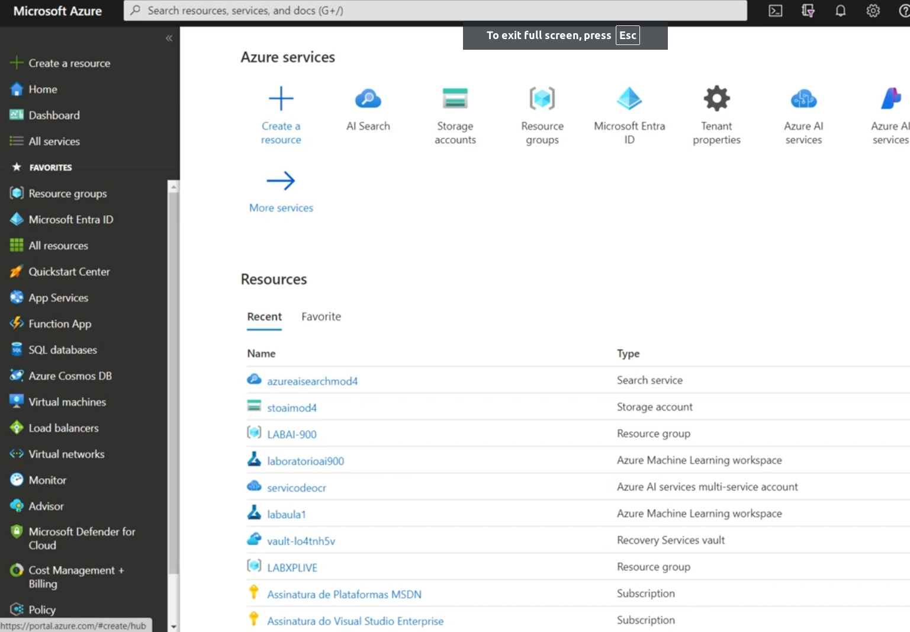
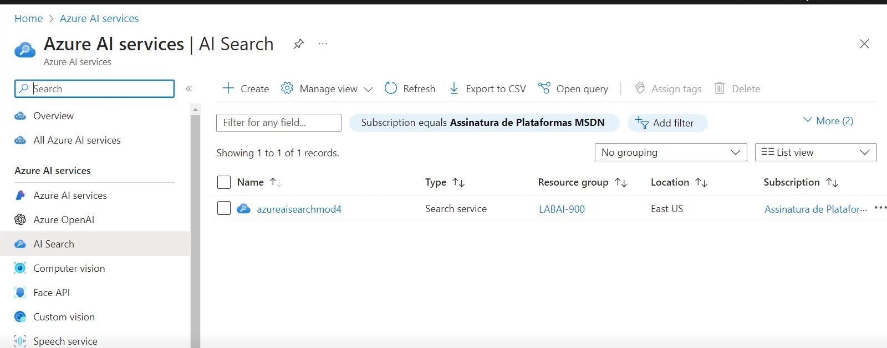
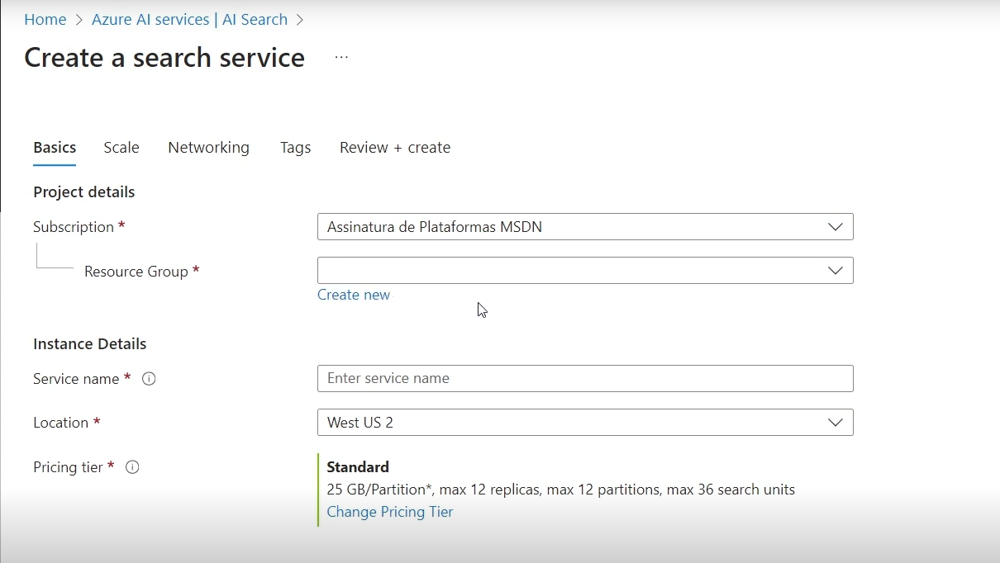
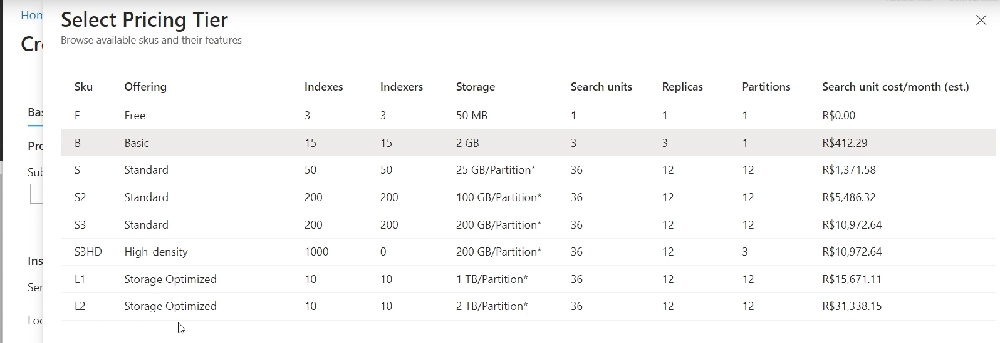
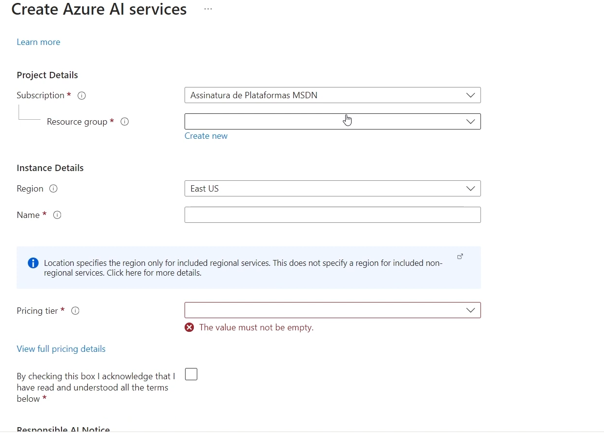

# Azure AI Lab — Azure Cognitive Search

## Knowledge Mining

- Content organization  
- Data is often locked in documents, PDFs, handwritten notes, etc.  
- Knowledge mining extracts insights — at scale  

**Azure Cognitive Search** is a knowledge mining platform powered by Azure AI.

## Azure Cognitive Search Solution

### Data Ingestion

- Azure Blob Storage containers  
- Azure Data Lake Storage Gen2  
- Azure Table Storage  

### AI Enrichment & Indexing

- Enables deeper understanding of content  
- Includes Vision, Natural Language Processing, and more  
- Optimizes content search through enriched indexing  

## AI Enrichment Capabilities

- Recognize entities in text  
- Translate text  
- Assess sentiment  

## Cognitive Search Lab Scenario

**Context:**  
We work in the Technology department of a national coffee store. We'll use AI Search to analyze client feedback from various locations and determine satisfaction with products and services.

> ⚠️ After practicing, don’t forget to delete your resources to avoid unexpected charges.

## Step-by-Step: Using Azure Cognitive Search

### 1. Create a Search Service  
Click **+ Create** and set up a new search service.

  
  

### 2. Select Pricing Tier  
Choose the **Basic** tier.  
  

Click **Review + create** to finalize.

### 3. Create Azure AI Services Resource

- **Pricing tier:** Standard S0  

### 4. Create Storage Account

Click **+ Create** to start a new storage account.

Although storage accounts offer many options, for this lab focus on:

- **Locally-redundant storage (LRS)** — a more affordable option

---

You can now search via the Azure Search portal or connect the service to an application.
