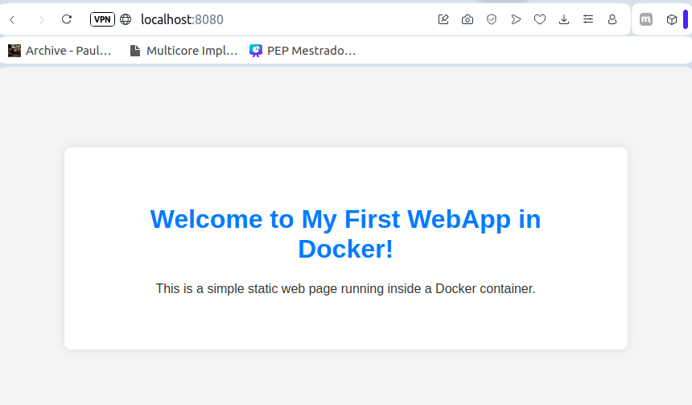

# WebApp with Docker

This project is a simple Hello World web app served with Apache in Docker.
We use Docker Compose to build and run the container with a single command.

## 🚀 Requirements

Is recommended Linux or WSL using Ubunto to practice

Docker Engine installed

Docker Compose v2
Check your version:
> docker compose version

Your user in the docker group
> sudo usermod -aG docker $USER

## ▶️ Running the app
Build and run with Docker Compose:

> docker compose up --build

--build ensures the image is rebuilt if something changed.

By default, the app will be available at:
👉 http://localhost:8080

## ⚡ Docker & Compose basicsImage: Blueprint for your app (defined by the Dockerfile).

- Container: Running instance of an image.

- docker compose up: Builds images (if needed) and starts containers.

## Why we need to add your user to the docker group?
The Docker daemon (dockerd) runs as root.

It listens on the Unix socket file:
> /var/run/docker.sock

By default, only root can access that socket.

So if you try to run:
> docker ps

without special permissions, you’ll get:
> permission denied while trying to connect to the Docker daemon socket

Members of this group are allowed to access /var/run/docker.sock without needing sudo.